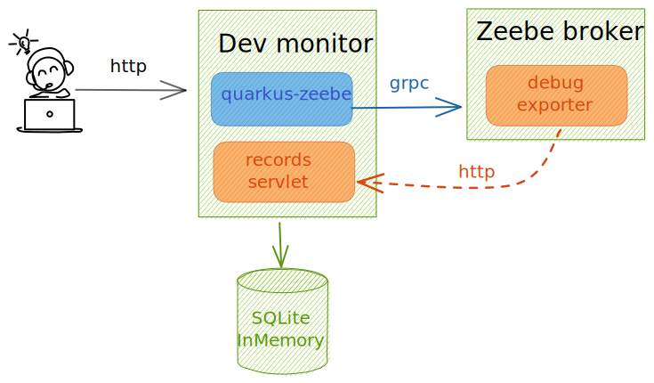
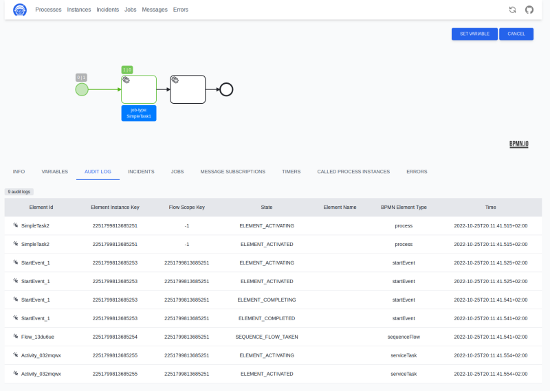
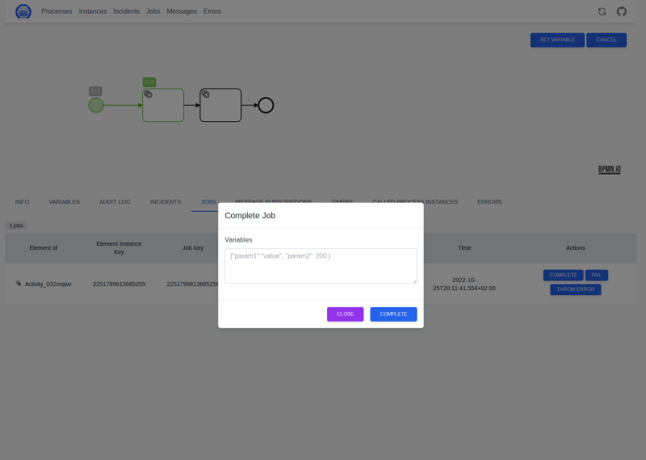
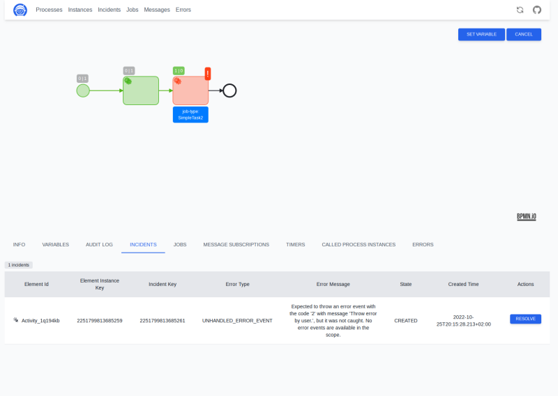

# zeebe-dev-monitor

Zeebe developer monitor build with [Quarkus](https://quarkus.io/) for local development. It uses in memory database [SQLite](https://www.sqlite.org/) to store the 
zeebe [debug exporter](https://github.com/camunda-community-hub/zeebe-test-container#debug-exporter) records.



## Configuration

```yaml
env:
  QUARKUS_ZEEBE_CLIENT_BROKER_GATEWAY_ADDRESS=zeebe:26500
```
## Screenshots





## Containers

```shell
docker pull ghcr.io/lorislab/zeebe-dev-monitor:latest
docker run -p 8080:8080 ghcr.io/lorislab/zeebe-dev-monitor:latest 
```


